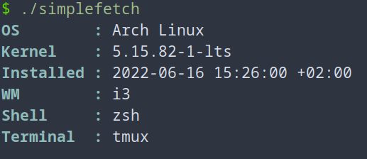
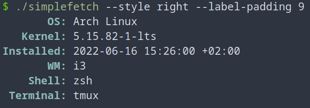
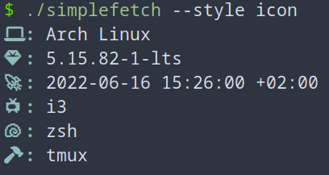

# simplefetch
Simple fetch tool for Linux OS

## Example
### Justified labels to the left

### Justified labels to the right

### Icons instead of labels


## Usage
```
$ ./simplefetch -h
Usage:
  ./simplefetch [OPTIONS]

Simple Linux system information fetcher.

Optional arguments:
  -h,--help             Show this help message and exit
  --label-padding LABEL_PADDING
                        Padding of section labels
  --style STYLE         Style of display. Available: left,right,icon
```

## Options
```
--label-padding LABEL_PADDING # sets number of blank space added before or after label
--style STYLE # sets display style. 
left -> Labels are justified to the left side and padding is added after them,
right -> Labels are justified to the right side and padding is added before them,
icon -> use icons instead of text labels
```
